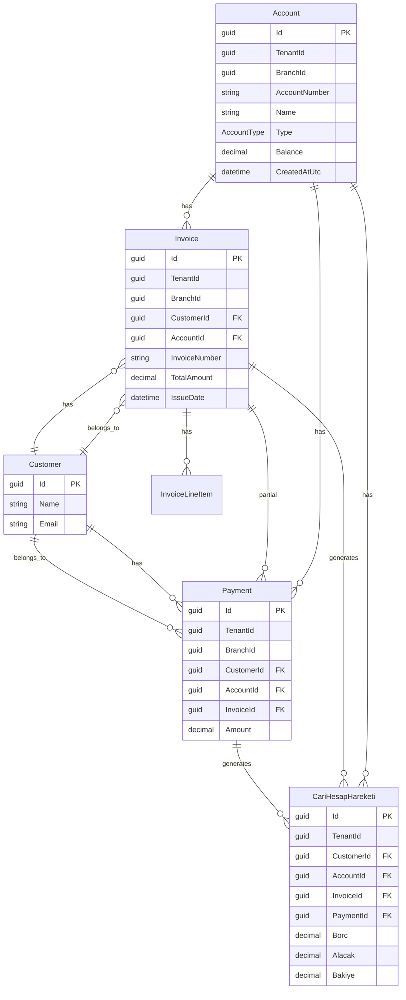
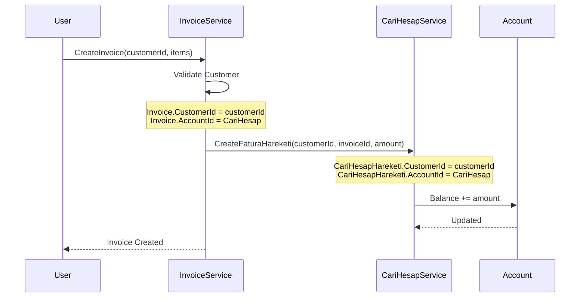
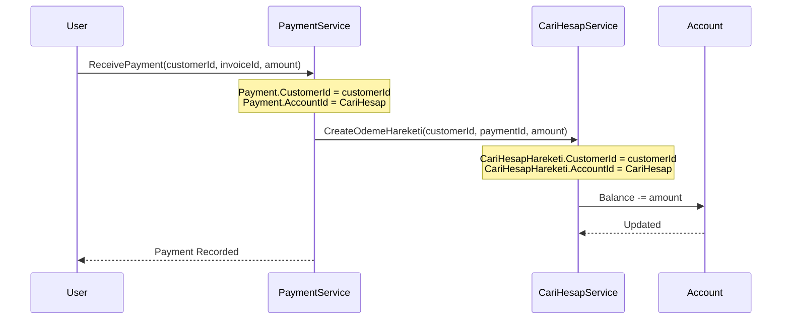

# Account Tablosu Yeniden Tasarım - Option A: Generic Balance Holder

## Seçilen Yaklaşım

Kullanıcı **Option A** seçti: Account = Generic Balance Holder

Bu yaklaşımda:
- Account tablosu sadece bakiye/hesap numarası tutar (CustomerId kaldırılır)
- Invoice.CustomerId üzerinden müşteri ilişkisi kurulur
- CariHesapHareketi üzerinden her hareketin CustomerId'si olur
- Her müşteri için değil, her "hesap türü" (Kasa, Banka, Gelir, Gider) için Account

---

## Yeni Entity Yapısı



---

## Değişiklikler

### 1. Account Entity - CustomerId Kaldırılır

```csharp
public class Account
{
    public Guid Id { get; set; }
    public Guid TenantId { get; set; }
    public Guid? BranchId { get; set; }
    
    // CustomerId KALDIRILDI - Artık sadece bakiye tutar
    
    public string AccountNumber { get; set; } = string.Empty;
    public string Name { get; set; } = string.Empty;
    public string? Description { get; set; }
    
    public AccountType Type { get; set; }  // Kasa, Banka, Gelir, Gider, CariHesap
    public AccountStatus Status { get; set; }
    
    public decimal Balance { get; set; }
    public decimal CreditLimit { get; set; }
    
    public DateTimeOffset CreatedAtUtc { get; set; }
    public DateTimeOffset? UpdatedAtUtc { get; set; }
    public bool IsDeleted { get; set; }
    
    // Navigation
    public ICollection<Invoice> Invoices { get; set; }
    public ICollection<Payment> Payments { get; set; }
    public ICollection<CariHesapHareketi> CariHesapHareketleri { get; set; }
}
```

### 2. Invoice Entity - CustomerId Eklenir

```csharp
public class Invoice
{
    public Guid Id { get; set; }
    public Guid TenantId { get; set; }
    public Guid? BranchId { get; set; }
    
    // YENİ: Müşteri ilişkisi
    public Guid CustomerId { get; set; }
    public Customer? Customer { get; set; }
    
    public Guid AccountId { get; set; }
    public Account? Account { get; set; }
    
    public string InvoiceNumber { get; set; }
    public InvoiceStatus Status { get; set; }
    
    public DateTimeOffset IssueDate { get; set; }
    public DateTimeOffset DueDate { get; set; }
    public decimal TotalAmount { get; set; }
    
    // ... diğer alanlar
}
```

### 3. Payment Entity - CustomerId Eklenir

```csharp
public class Payment
{
    public Guid Id { get; set; }
    public Guid TenantId { get; set; }
    public Guid? BranchId { get; set; }
    
    // YENİ: Müşteri ilişkisi
    public Guid CustomerId { get; set; }
    public Customer? Customer { get; set; }
    
    public Guid AccountId { get; set; }
    public Account? Account { get; set; }
    
    public Guid? InvoiceId { get; set; }
    public Invoice? Invoice { get; set; }
    
    public decimal Amount { get; set; }
    public DateTimeOffset PaymentDate { get; set; }
    
    // ... diğer alanlar
}
```

### 4. CariHesapHareketi - CustomerId Eklenir

```csharp
public class CariHesapHareketi
{
    public Guid Id { get; set; }
    public Guid TenantId { get; set; }
    public Guid? BranchId { get; set; }
    
    // YENİ: Müşteri ilişkisi (Invoice veya Payment'dan gelir)
    public Guid CustomerId { get; set; }
    
    public Guid AccountId { get; set; }
    public Account? Account { get; set; }
    
    public Guid? InvoiceId { get; set; }
    public Invoice? Invoice { get; set; }
    
    public Guid? PaymentId { get; set; }
    public Payment? Payment { get; set; }
    
    public HareketTipi HareketTipi { get; set; }
    public decimal Borc { get; set; }
    public decimal Alacak { get; set; }
    public decimal Bakiye { get; set; }
}
```

---

## İş Akışı

### Fatura Oluşturma (Müşteri Bazlı)


### Ödeme Alma (Müşteri Bazlı)


---

## Yeni Sorgu Örnekleri

### 1. Müşterinin Cari Hesap Ekstresi (Borc/Alacak Listesi)
```csharp
public async Task<IReadOnlyList<CariHesapHareketi>> GetCustomerEkstrasıAsync(
    Guid tenantId, 
    Guid customerId,
    DateTimeOffset? startDate,
    CancellationToken ct)
{
    return await _db.CariHesapHareketleri
        .Where(x => x.TenantId == tenantId 
                 && x.CustomerId == customerId
                 && x.Account.Type == AccountType.CariHesap)
        .OrderBy(x => x.IslemTarihi)
        .ToListAsync(ct);
}
```

### 2. Müşterinin Toplam Borcu (Cari Hesap Bakiyesi)
```csharp
public async Task<decimal> GetCustomerBalanceAsync(
    Guid tenantId,
    Guid customerId,
    CancellationToken ct)
{
    // Toplam Borç - Toplam Alacak
    var movements = await _db.CariHesapHareketleri
        .Where(x => x.TenantId == tenantId 
                 && x.CustomerId == customerId
                 && x.Account.Type == AccountType.CariHesap)
        .ToListAsync(ct);
    
    return movements.Sum(x => x.Borc) - movements.Sum(x => x.Alacak);
}
```

### 3. Müşterinin Faturaları
```csharp
public async Task<IReadOnlyList<Invoice>> GetCustomerInvoicesAsync(
    Guid tenantId,
    Guid customerId,
    CancellationToken ct)
{
    return await _db.Invoices
        .Where(x => x.TenantId == tenantId 
                 && x.CustomerId == customerId)
        .OrderByDescending(x => x.IssueDate)
        .ToListAsync(ct);
}
```

### 4. Müşterinin Ödemeleri
```csharp
public async Task<IReadOnlyList<Payment>> GetCustomerPaymentsAsync(
    Guid tenantId,
    Guid customerId,
    CancellationToken ct)
{
    return await _db.Payments
        .Where(x => x.TenantId == tenantId 
                 && x.CustomerId == customerId)
        .OrderByDescending(x => x.PaymentDate)
        .ToListAsync(ct);
}
```

---

## Yapılacak Değişiklikler (Todo Listesi)

### Entity Değişiklikleri
- [ ] Account.cs'den CustomerId kaldır
- [ ] Invoice.cs'ye CustomerId ekle
- [ ] Payment.cs'ye CustomerId ekle  
- [ ] CariHesapHareketi.cs'ye CustomerId ekle

### DbContext Değişiklikleri
- [ ] AccountingDbContext'de yeni ilişkileri konfigure et
- [ ] Customer entity'sini DbContext'e dahil et (cross-module reference)

### Service Değişiklikleri
- [ ] InvoiceService - Create/Update metodlarında CustomerId zorunlu yap
- [ ] PaymentService - Create metodunda CustomerId zorunlu yap
- [ ] CariHesapService - Hareket oluştururken CustomerId'yi Invoice/Payment'dan al

### Controller Değişiklikleri
- [ ] InvoicesController - Create/Update endpoint'lerinde CustomerId al
- [ ] PaymentsController - Create endpoint'inde CustomerId al

### DTO Değişiklikleri
- [ ] Invoice DTO'larına CustomerId ekle
- [ ] Payment DTO'larına CustomerId ekle

### Migration
- [ ] Yeni migration oluştur
- [ ] CustomerId kolonlarını nullable olarak ekle (backward compatibility)
- [ ] Mevcut veriler için Account.CustomerId -> Invoice.CustomerId mapping

---

## Özet

| Önceki (Sorgulanan) | Yeni (Option A) |
|---------------------|-----------------|
| Account.CustomerId | Invoice.CustomerId |
| Her müşteri için Account | Her hesap türü için Account (Kasa, Banka...) |
| Invoice -> Account | Invoice -> Customer + Account |
| Müşteri bakiyesi Account'ta | Müşteri bakiyesi CariHesapHareketi üzerinden hesaplanır |

Bu yaklaşımda:
1. **Account** sadece "hesap" kavramını temsil eder (Kasa, Banka, Gelir, Gider)
2. **Invoice** ve **Payment** doğrudan **Customer** ile ilişkilidir
3. **CariHesapHareketi** hem Customer hem Account referansı taşır
4. Müşteri bakiyesi (`Sum(Borc) - Sum(Alacak)`) hareketler üzerinden hesaplanır